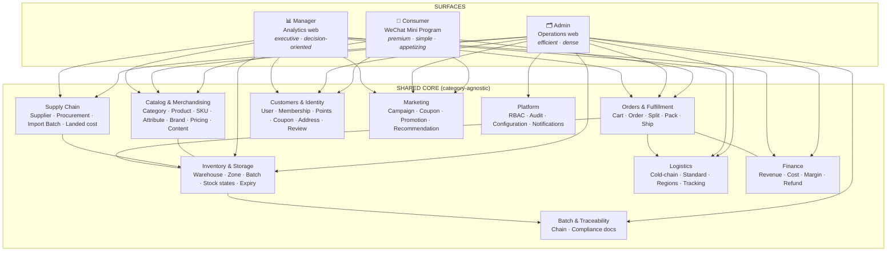

# 03 — Platform Structure Map

## 1. The shape of the platform

Three **surfaces** (Consumer, Admin, Manager) are thin, role‑appropriate views onto **one shared core** of capabilities and data. Nothing about seafood — or any single category — is baked into the core; categories, attributes, and filters are configuration that flows out to every surface.

## 2. Why "surfaces over one core" matters

- **No duplicated truth.** A product, a price, a batch, an order exists once. The Consumer PDP, the Admin editor, and the Manager sales report all read the same objects.
- **Category expansion propagates automatically.** Add a category + attribute set in Admin, and Consumer navigation, search, filters, and PDP adapt — because they render *from* the core, not from category‑specific code.
- **One RBAC, one audit trail.** Admin and Manager share the permission and audit model ([12](12-roles-permissions.md)).
- **Clear separation of concerns.** Consumer = demand & experience. Admin = operate the business. Manager = steer the business.

## 3. Surface responsibilities

| Capability area | Consumer | Admin | Manager |
|-----------------|:--------:|:-----:|:-------:|
| Catalog & merchandising | Browse/buy | **Manage** | Analyse |
| Supply chain / procurement | — | **Manage** | Analyse |
| Inventory & storage | Availability only | **Manage** | Analyse / alert |
| Batch & traceability | Trust view (opt.) | **Manage / trace** | Oversight |
| Orders & fulfillment | Place / track | **Operate** | Analyse |
| Logistics | Track | **Operate** | Analyse |
| Customers & membership | Self‑service | **Service** | Analyse |
| Marketing | Receive | **Run** | Analyse / approve |
| Finance | Pay | Record | **Analyse / approve** |
| Platform (RBAC/config) | — | **Administer** | View (scoped) |

"Manage/Operate" = create, edit, execute. "Analyse" = read dashboards & reports. Exact rights are in the [permission matrix](12-roles-permissions.md).

## 4. The core is category‑agnostic — three worked examples

| Concern | Seafood today | Meat today | Frozen vegetables (future) | Mechanism (unchanged) |
|--------|---------------|-----------|----------------------------|-----------------------|
| Attributes | Species, fishing area, wild/farmed, catch method | Cut, grade, marbling, farm | Variety, cut style, blanched? | **Attribute Set** bound to category |
| Filters | Species, origin, wild/farmed, size | Cut, grade, species, origin | Variety, origin, pack size | **Filters generated from attributes** |
| Storage | Frozen | Frozen/Chilled | Frozen | **Storage class on SKU/batch** |
| Logistics | Cold‑chain | Cold‑chain | Cold‑chain | **Per‑shipment strategy** |
| Trace | Vessel/catch → batch | Farm/lot → batch | Field/lot → batch | **Batch model** |

Nothing in the platform structure changes to add "frozen vegetables." That is the whole point.

## 5. Cross‑cutting services (present in the core, used by all)

- **Search & discovery** — indexes the universal product model (keyword, brand, category, origin, SKU/barcode).
- **Notifications** — order, delivery, promotion, and (Admin/Manager) operational alerts.
- **Configuration** — storage classes, delivery regions, fee rules, attribute sets, feature flags.
- **Audit** — every privileged action recorded ([12](12-roles-permissions.md)).

## 6. Map to the rest of this package

- Catalog & merchandising → [04](04-product-category-architecture.md), [13](13-core-data-model.md)
- Supply chain → [09](09-supply-chain-flows.md)
- Inventory / batch / traceability → [11](11-batch-traceability-architecture.md), [13](13-core-data-model.md)
- Orders / fulfillment / logistics → [10](10-order-fulfillment-architecture.md)
- Surfaces (screens) → [05](05-consumer-sitemap.md), [06](06-admin-sitemap.md), [07](07-manager-sitemap.md)
- RBAC → [12](12-roles-permissions.md)
