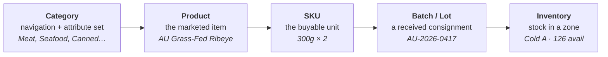
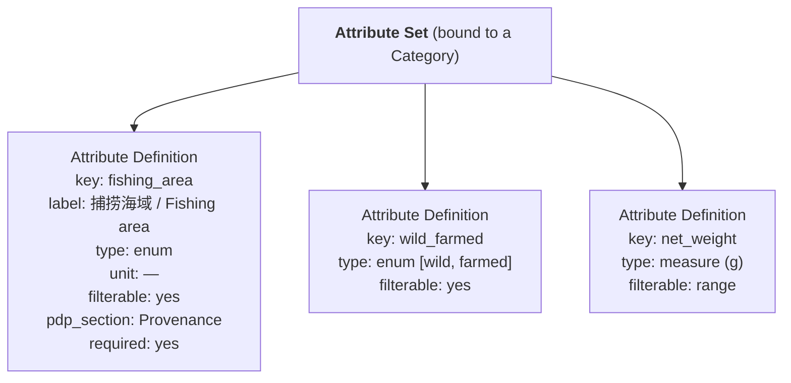

# 04 — Product & Category Architecture

> This is the architectural heart of the platform. If this model is right, the "imported‑food platform, not a seafood app" promise holds. Everything downstream — search, filters, PDP, inventory, logistics — reads from here.

## 1. The universal food product model

There is **one** product model for the entire platform. Seafood, meat, canned fish, sauces, and future dairy or bakery are all the *same* kind of object with *different configured attributes*. We never build "a seafood product type" and "a meat product type" as separate systems.

The model is layered so that each concern lives at exactly one level:



| Level | Owns | Example (meat) | Example (canned) |
|-------|------|----------------|------------------|
| **Category** | Navigation, the **attribute set**, category‑level filters & compliance flags | Meat → Beef | Canned Food → Canned Fish |
| **Product** | Brand, description, images, marketing copy, **category‑specific attribute values**, reviews | Australian Grass‑Fed Beef Ribeye | Imported Tuna in Olive Oil |
| **SKU** | The buyable variant: pack size, price, member price, barcode, **storage class**, weight | 300 g × 2 | 185 g × 6 |
| **Batch / Lot** | Production/expiry dates, import batch, supplier, origin, landed cost, compliance docs | AU‑2026‑0417 | ES‑2026‑1120 |
| **Inventory** | Quantity by **warehouse → zone**, and by **stock state** | Cold Storage A · 126 available | Ambient W2 · 840 available |

The hierarchy is **identical** whether the product is frozen ribeye or ambient canned tuna — only the values differ. That identity is the design.

## 2. Category, subcategory, product type — a scalable taxonomy

The backend supports a deep taxonomy; the consumer sees a shallow, fast one.

```
Category → Subcategory → Product Type → Product → SKU
```

- **Consumers browse 2–3 levels** (e.g., *Seafood → Salmon*, *Meat → Beef*, *Canned → Tuna*).
- **The backend keeps the full depth** for merchandising, attribute inheritance, and reporting.

**Launch taxonomy (illustrative — all editable data, none hard‑coded):**

```
Imported Food
├─ Seafood
│  ├─ Fish (Salmon, Tuna, Cod, …)
│  ├─ Shrimp
│  ├─ Crab
│  ├─ Shellfish
│  └─ Mollusks
├─ Meat
│  ├─ Beef
│  ├─ Pork
│  ├─ Chicken
│  ├─ Lamb
│  └─ Other meat
├─ Canned Food
│  ├─ Canned Fish
│  ├─ Canned Meat
│  └─ Canned Seafood
├─ Processed Food
├─ Ready-to-cook
└─ Other Imported Food
```

**Future categories** (Dairy, Frozen Vegetables, Frozen Fruit, Sauces, Condiments, Snacks, Bakery, Dry Goods, Premium Groceries…) are added the same way: create the node, bind an attribute set, publish. No redesign. ([20](20-future-scalability.md))

> **[ASSUMPTION · A‑07]** Taxonomy depth is *Category → Subcategory → Product Type → Product → SKU → Batch*, with consumers seeing 2–3 levels. A product may also carry secondary tags (e.g., "New Arrival", "Premium Selection", "Wild‑Caught") for cross‑cutting discovery independent of its tree position.

### Categories vs. tags — two discovery mechanisms
- **Category tree**: the single canonical home of a product (one primary path).
- **Collections / tags**: many‑to‑many merchandising groupings (New Arrivals, Best Sellers, Norwegian Selection, Deals). This lets the homepage's "Imported Selection" or "Premium Selection" rails exist without distorting the tree.

## 3. Configurable attributes — the key to "not a seafood app"

Every category binds an **Attribute Set**: an ordered list of attribute definitions. Products in that category fill in values. Filters and PDP sections are generated from these definitions. **Adding an attribute is data entry, not development.**



**Attribute definition fields:** `key`, `label` (localised), `data type` (text · number · measure+unit · enum · multi‑enum · boolean · date), `unit`, `allowed values`, `required?`, `filterable?` (and filter style: term / range / boolean), `searchable?`, `pdp_section` (where it renders), `display order`, `help text`, `applies‑to level` (product or SKU).

**Attribute inheritance:** a subcategory inherits its parent's set and may add to it. *Seafood* defines shared seafood attributes; *Salmon* adds a couple more. No duplication.

### The same mechanism across categories

| Category | Example category‑specific attributes (all just Attribute Definitions) |
|----------|----------------------------------------------------------------------|
| **Seafood** | Species, Fishing area (FAO zone), Wild/Farmed, Catch method, Size grade |
| **Meat** | Animal species, Cut, Grade, Marbling score, Farm/origin, Processing type |
| **Canned Food** | Can size, Net weight, Drain weight, Ingredients, Packing medium, Storage type |
| **Dairy (future)** | Fat %, Pasteurisation, Aging, Milk type |
| **Sauces (future)** | Flavour, Spice level, Ingredients, Allergens |

There is **one** attribute engine. "Marbling score" and "fishing area" are the same kind of thing to the system.

## 4. The full product data model (universal fields + category attributes)

**Universal fields** apply to *every* product/SKU/batch regardless of category; **category attributes** are the configurable layer above.

### Universal — General (Product/SKU)
Product name · Brand · Category · Subcategory · SKU code · Barcode · Images · Description · Country of origin · Manufacturer · Supplier · Importer.

### Universal — Food (Product/SKU)
Ingredients · Allergens · Nutrition (per‑100g + per‑serving) · Net weight · Gross weight · Package size · Package type · Serving size · Shelf life · Storage requirements · Preparation instructions.

> **[ASSUMPTION · A‑11]** Nutrition uses metric and per‑100 g to match China's GB label convention, with an optional per‑serving column.

### Universal — Import & Compliance (mostly Batch, some Product)
Country of origin · Production country · Import country · Import batch · Customs information · Import documentation · Traceability chain · Certification · Compliance information.

### Universal — Logistics (SKU/Batch)
**Storage class** (Ambient / Chilled / Frozen) · Storage temperature range · Warehouse type · Cold‑chain requirement · Shipping requirement · Delivery restrictions.

### Category‑specific — via Attribute Set
Whatever the category needs (see §3). Rendered dynamically; **not every product uses every field.**

> **Rule:** if an attribute is meaningful to more than one category, it is **universal**; if it is meaningful to one category (family), it is a **category attribute**. This keeps the universal core lean and the categories expressive.

## 5. Where storage temperature lives — and why it's decisive

**Storage class (Frozen / Chilled / Ambient) is a property of the SKU (defaulted) and confirmable per Batch — never a property of the category.**

Consequences:
- A category can contain mixed‑temperature products (e.g., "Processed Food" holding both frozen dumplings and ambient sauces).
- A **future frozen category inherits all cold‑chain behaviour automatically** — inventory zone, packaging, logistics strategy, delivery windows — because those systems key off storage class, not category.
- **Orders reason about temperature** (splitting, packaging, fees) from SKU/batch storage class. ([10](10-order-fulfillment-architecture.md))

> **[ASSUMPTION · A‑06]** Launch storage classes: **Frozen (≤ −18 °C), Chilled (0–4 °C), Ambient.** Storage classes are themselves configuration, so a fourth (e.g., "Cool 8–15 °C") can be added later.

## 6. SKU model

A SKU is the **buyable unit** and the anchor of price and stock.

- **Identity:** SKU code, barcode, parent product.
- **Packaging:** pack description (e.g., 300 g × 2), net/gross weight, package type.
- **Commerce:** base price, **member price**, promotional price (time‑boxed), tax class, purchase limits.
- **Logistics:** storage class, cold‑chain requirement, shipping constraints, dimensional/weight data.
- **State:** status (draft / active / hidden / discontinued), availability (derived from inventory).

A product with several variants (e.g., 300 g×2 and 500 g×1) has several SKUs; each carries its own price and stock. Cross‑SKU concerns (brand, description, category attributes) live on the Product.

## 7. Batch / lot model (why it sits between SKU and inventory)

Because the goods are *imported*, the **batch** is where provenance, dates, cost, and compliance become concrete. Two consignments of the same SKU can differ in origin batch, expiry, landed cost, and documents — so stock, expiry, margin, and traceability are all **batch‑aware**.

Batch carries: batch/lot number · production date · expiry date · import batch reference · supplier · country of origin · warehouse & zone · arrival date · quantity received · storage condition · landed cost · compliance/customs documents. Full treatment in [11 — Batch & Traceability](11-batch-traceability-architecture.md).

## 8. Inventory (summary here; full model in [11] & [13])

Inventory is quantity of a **batch**, in a **warehouse → storage zone**, in a **stock state**: Available · Reserved · Incoming · Allocated · Damaged · Expired · Quarantine. Allocation prefers **FEFO** (first‑expiry‑first‑out) for perishable classes.

## 9. Two worked examples (same architecture, different values)

**A. Australian Grass‑Fed Beef Ribeye**
```
Category: Meat → Beef
Attribute Set (Meat): species=Beef, cut=Ribeye, grade=Grass-Fed, marbling=3, farm=Victoria AU, processing=Chilled-then-frozen
Product: brand, images, description, reviews
SKU: 300g × 2 · barcode · ¥168 / member ¥152 · storage class = Frozen
Batch: AU-2026-0417 · prod 2026-03-01 · exp 2027-03-01 · importer X · landed cost ¥/ unit · docs
Inventory: Warehouse A → Frozen Zone · Available 126
```

**B. Imported Tuna in Olive Oil**
```
Category: Canned Food → Canned Fish
Attribute Set (Canned): can_size=185g, net_weight=185g, drain_weight=130g, packing_medium=Olive oil, ingredients, storage_type=Ambient
Product: brand, images, description, reviews
SKU: 185g × 6 · barcode · ¥89 / member ¥80 · storage class = Ambient
Batch: ES-2026-1120 · prod 2026-01-10 · exp 2029-01-10 · importer Y · landed cost · docs
Inventory: Ambient Warehouse W2 · Available 840
```

Same five levels, same fields, same engine. The only differences are **data**. That is the guarantee that we built a platform, not a seafood app.

## 10. Design rules (the guardrails)

1. **One product model.** No per‑category product tables or code paths.
2. **Attributes are data.** New fields = new Attribute Definitions, entered in Admin.
3. **Filters derive from attributes.** No bespoke filter code per category. ([Filter framework →](14-ux-architecture.md#filters))
4. **Temperature is a SKU/batch property**, never a category.
5. **Consumer sees a shallow tree; backend keeps the deep one.**
6. **Universal vs. category** split by the "meaningful to >1 category?" test (§4).
7. **Everything category‑ or storage‑specific is configuration**, surfaced identically to Consumer, Admin, and Manager.
