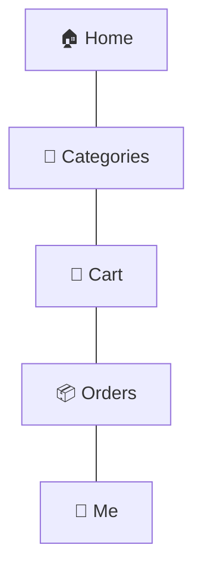

# 05 — Consumer Sitemap (WeChat Mini Program)

The consumer app is organised around a **5‑tab bottom navigation** (the WeChat Mini Program convention), with deep flows hanging off each tab. Structure is inspired by Pupu's clarity; content and identity are ours.

## 1. Bottom navigation



> **[ASSUMPTION]** Five tabs: **Home · Categories · Cart · Orders · Me.** "Categories" is a dedicated tab (not merged into Home) because a broad imported‑food catalog needs a first‑class browse surface.

## 2. Full sitemap

```
Consumer App
│
├─ 🏠 Home
│  ├─ Header: delivery location · search entry · notifications · (member chip)
│  ├─ Hero / campaign carousel (brand story, imported-food campaigns)
│  ├─ Main category quick-nav (Seafood, Meat, Canned, Frozen, Processed, New, Deals)
│  ├─ Trust strip (Global sourcing · Authentic imports · Cold-chain · Traceability)
│  ├─ Product rails
│  │   ├─ Best Sellers
│  │   ├─ Imported Selection
│  │   ├─ New Arrivals
│  │   ├─ Premium Selection
│  │   ├─ Deals / Promotions
│  │   └─ Recommended for You
│  └─ Content teasers (Recipes · Origin stories · Cooking guides)
│
├─ 🧭 Categories
│  ├─ Left rail: top categories  ·  Right pane: subcategories + product types
│  ├─ Category landing (banner, subcategory chips, sorted product grid)
│  └─ Product Listing (grid/list)
│      ├─ Sort (recommended, price, new, best-selling)
│      ├─ Filters (universal + category-specific, dynamic)  → see UX §Filters
│      └─ Product cards (image, name, origin flag, storage tag, price/member price, badges, add)
│
├─ 🔎 Search  (from Home/Categories header)
│  ├─ Search entry (history, hot searches, suggestions-as-you-type)
│  ├─ Results (same listing + filters as category)
│  └─ Scan (barcode) → product  [optional, D-05 dependent]
│
├─ 📄 Product Detail (PDP)  — adaptive to category
│  ├─ Gallery · name · brand · price / member price · promo
│  ├─ Trust badges (origin flag, certification, cold-chain, wild/farmed…)
│  ├─ Key facts (origin, weight, package, storage class, shelf life, availability)
│  ├─ Delivery info (method, window, fee estimate for this item's temperature)
│  ├─ Category-specific attributes (Provenance / Cut & Grade / Can & Packing…)
│  ├─ Ingredients · Allergens · Nutrition · Preparation
│  ├─ Traceability summary (batch / origin)  [D-05 dependent]
│  ├─ Reviews (verified purchase)
│  ├─ Recommendations (related, "pairs with", same origin)
│  └─ Sticky bar: quantity · Add to cart · Buy now
│
├─ 🛒 Cart
│  ├─ Items grouped by temperature/fulfillment group (Frozen · Chilled · Ambient)
│  ├─ Per-group delivery note (packaging & fee implications)
│  ├─ Coupons applicable · subtotal · estimated delivery fee
│  ├─ Recommended add-ons / "reach free-shipping" nudge
│  └─ Checkout
│
├─ 💳 Checkout
│  ├─ Delivery address (select/add)
│  ├─ Delivery method & window per fulfillment group
│  ├─ Coupons & points
│  ├─ Order summary (items, fees per group, member savings, total)
│  ├─ Remarks / invoice (fapiao)
│  └─ Pay (WeChat Pay)
│      ├─ Address book (list · add · edit · default)
│      └─ Payment result (success / retry / pending)
│
├─ 📦 Orders
│  ├─ Order list (All · To pay · To ship · To receive · To review · After-sales)
│  ├─ Order Detail (items, status timeline, fees, invoice, actions)
│  ├─ Tracking (per shipment — cold-chain & standard may differ)
│  ├─ Reorder
│  └─ After-sales (refund / return / quality issue · reason · photos · status)
│
└─ 👤 Me (Account)
   ├─ Profile & membership (tier, points, benefits)
   ├─ Coupons & vouchers
   ├─ Addresses
   ├─ Favourites / wishlist
   ├─ Browsing & purchase history
   ├─ Reviews I wrote
   ├─ Notifications & settings
   ├─ Customer service / help
   └─ Content hub (Recipes · Food knowledge · Origin stories · Guides)
```

## 3. Screen inventory (the 16 required, mapped)

| # | Screen | Location above |
|---|--------|----------------|
| 1 | Home | 🏠 Home |
| 2 | Category | 🧭 Categories → Category landing |
| 3 | Product listing | 🧭 Categories → Product Listing |
| 4 | Product detail | 📄 PDP |
| 5 | Search | 🔎 Search |
| 6 | Cart | 🛒 Cart |
| 7 | Checkout | 💳 Checkout |
| 8 | Address | 💳 Checkout → Address book |
| 9 | Payment | 💳 Checkout → Pay / result |
| 10 | Orders | 📦 Orders → list |
| 11 | Order detail | 📦 Orders → detail |
| 12 | Tracking | 📦 Orders → Tracking |
| 13 | Account | 👤 Me |
| 14 | Membership | 👤 Me → Membership |
| 15 | Coupons | 👤 Me → Coupons |
| 16 | After‑sales | 📦 Orders → After‑sales |

## 4. Notes for the imported‑food context

- **Temperature is visible early:** cards and cart show a storage tag (Frozen/Chilled/Ambient); cart groups by fulfillment group so mixed‑temperature orders are understandable before checkout.
- **Provenance is a discovery axis:** origin flags on cards; "by origin" browse and filter; origin stories in content.
- **Trust is persistent:** the home trust strip and PDP trust badges reflect the four brand pillars.
- **Membership & coupons** are wired through cart, checkout, PDP (member price), and Me.

See the visual treatment in [17 — Consumer Interface Preview](17-consumer-interface-preview.md) and the live [`preview/index.html`](../../preview/index.html).
