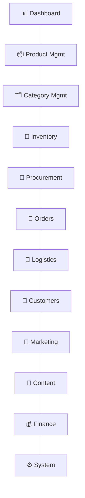

# 06 — Admin Sitemap (Operations Web)

The Admin platform is the operational backbone — efficient, structured, information‑dense — organised around the imported‑food business, not around seafood. Left‑nav modules, each with list/detail/editor patterns. Every module is permission‑gated ([12](12-roles-permissions.md)).

## 1. Module map



## 2. Full sitemap

```
Admin
│
├─ 📊 Dashboard
│  └─ GMV · revenue · orders · customers · product sales · inventory health ·
│     low stock · expiring inventory · supply-chain status · procurement ·
│     logistics · gross margin · alerts
│
├─ 📦 Product Management
│  ├─ Products (list · search · filter · bulk actions · status)
│  ├─ Product Editor (adaptive form driven by the category's attribute set)
│  │   ├─ General (name, brand, category, images, description)
│  │   ├─ Food info (ingredients, allergens, nutrition, shelf life, storage)
│  │   ├─ Category attributes (dynamic — Provenance / Cut & Grade / Can & Packing…)
│  │   ├─ SKUs (pack, barcode, price, member price, storage class, limits)
│  │   ├─ Pricing & promotions
│  │   ├─ Media & content
│  │   └─ Compliance & documents
│  ├─ Brands
│  ├─ Attributes (attribute definitions & data types)
│  └─ Pricing (bulk pricing, member price, price lists)
│
├─ 🗂️ Category Management
│  ├─ Category tree (create/reorder/merge · publish)
│  ├─ Subcategories & product types
│  ├─ Attribute Sets (bind attributes to categories, inheritance)
│  ├─ Filter configuration (which attributes filter, and how)
│  └─ Compliance flags (age/restricted gating — reserved)
│
├─ 🧊 Inventory
│  ├─ Warehouses (facilities)
│  ├─ Storage zones (Frozen · Chilled · Ambient)
│  ├─ Stock (by SKU · batch · zone · state)
│  ├─ Batches (production/expiry, import ref, supplier, origin, docs, landed cost)
│  ├─ Stock movements (receipts, transfers, adjustments, allocations, write-offs)
│  ├─ Expiry management (FEFO, expiring soon, expired)
│  └─ Inventory alerts (low stock, expiring, quarantine, damaged)
│
├─ 🚢 Procurement
│  ├─ Suppliers (profiles, certifications, terms)
│  ├─ Purchase Orders (create · approve · track)
│  ├─ Import Batches (customs, import docs, landed cost build-up)
│  ├─ Costs (product + freight + duty + handling → landed cost)
│  └─ Arrivals (receiving against PO → batch creation)
│
├─ 🧾 Orders
│  ├─ Orders (list · search · filter · status)
│  ├─ Order Detail (items, fulfillment groups, payments, timeline)
│  ├─ Fulfillment (allocation, picking, packing by temperature)
│  ├─ Payments (captured, pending, reconciliation refs)
│  ├─ Refunds & After-sales (requests, approvals, resolutions)
│  └─ Shipping (handoff to logistics)
│
├─ 🚚 Logistics
│  ├─ Cold-chain shipments
│  ├─ Standard shipments
│  ├─ Shipping regions & rules (fees by temperature/region/weight)
│  ├─ Delivery windows
│  ├─ Tracking
│  └─ Delivery exceptions
│
├─ 👥 Customers
│  ├─ Users (profiles, order history)
│  ├─ Membership (tiers, benefits)
│  ├─ Points / loyalty
│  ├─ Coupons (issuance, targeting)
│  └─ Customer service (tickets, notes)
│
├─ 📣 Marketing
│  ├─ Campaigns
│  ├─ Coupons & promotions (rules, thresholds, member-only)
│  ├─ Homepage management (rails, banners, collections)
│  └─ Recommendations (rules / merchandised slots)
│
├─ 📝 Content
│  ├─ Recipes
│  ├─ Food knowledge / education
│  ├─ Brand story
│  └─ Origin / country stories
│
├─ 💰 Finance
│  ├─ Revenue
│  ├─ Cost (landed cost, storage, logistics)
│  ├─ Gross margin (by SKU · batch · order · category)
│  ├─ Payments
│  └─ Refunds
│
└─ ⚙️ System
   ├─ Users (staff)
   ├─ Roles & permissions (RBAC matrix)
   ├─ Audit logs
   └─ Configuration (storage classes, regions, fee rules, feature flags)
```

## 3. Required screen inventory (14, mapped)

| # | Screen | Location |
|---|--------|----------|
| 1 | Dashboard | 📊 Dashboard |
| 2 | Products | 📦 → Products |
| 3 | Product editor | 📦 → Product Editor |
| 4 | Categories | 🗂️ → Category tree |
| 5 | Inventory | 🧊 → Stock |
| 6 | Batch management | 🧊 → Batches |
| 7 | Suppliers | 🚢 → Suppliers |
| 8 | Procurement | 🚢 → Purchase Orders / Import Batches |
| 9 | Orders | 🧾 → Orders |
| 10 | Logistics | 🚚 → Shipments |
| 11 | Customers | 👥 → Users |
| 12 | Marketing | 📣 → Campaigns/Coupons |
| 13 | Finance | 💰 → Margin |
| 14 | Roles & permissions | ⚙️ → RBAC |

## 4. Cross‑module principles

- **The Product Editor is adaptive:** it renders the fields for the selected category's attribute set — the same form builds a salmon, a ribeye, or a can of tuna. No category‑specific editor.
- **Batch is everywhere it matters:** procurement creates batches; inventory tracks them; orders allocate them; finance costs them; traceability reads them.
- **Alerts are actionable:** low stock, expiring inventory, quarantine, and delivery exceptions link straight to the object and the action.
- **Everything privileged is audited** and permission‑scoped.

Visual treatment: [18 — Admin Interface Preview](18-admin-interface-preview.md) and [`preview/index.html`](../../preview/index.html).
