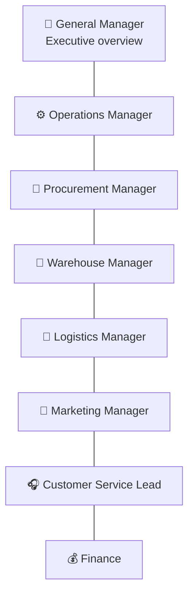

# 07 — Manager Sitemap (Analytics / Executive Web)

The Manager platform gives each leadership role a **decision‑oriented** view: *Dashboard → KPIs → Alerts → Tasks → Actions.* It deliberately shows less than Admin — each role sees the signals and levers relevant to them, nothing more. It reads from the same core; it does not duplicate operational screens.

## 1. Role dashboards



## 2. Full sitemap

```
Manager
│
├─ 🎯 Executive Dashboard (General Manager)
│  ├─ KPIs: GMV, revenue, orders, AOV, gross margin %, active customers, member share
│  ├─ Trends: sales over time, category mix (seafood share vs. rest — breadth signal)
│  ├─ Health: inventory value, expiring value, on-time cold-chain %, NPS/CSAT
│  ├─ Alerts: margin dips, stockouts of hero SKUs, expiry risk, delivery SLA breaches
│  └─ Drill-down into any functional dashboard
│
├─ ⚙️ Operations Dashboard (Operations Manager)
│  ├─ KPIs: orders/day, fulfillment cycle time, split-order rate, on-time %, exceptions
│  ├─ Bottlenecks: picking, packing, handoff, carrier delays
│  ├─ Alerts: SLA at risk, exception backlog
│  └─ Tasks/Actions: assign, escalate, adjust windows/regions
│
├─ 🚢 Procurement Dashboard (Procurement Manager)
│  ├─ KPIs: PO pipeline, in-transit imports, landed cost trend, supplier on-time, sell-through
│  ├─ Cost: landed-cost build-up (product/freight/duty), FX exposure, margin by supplier
│  ├─ Alerts: reorder points, arrivals due, cost spikes, supplier compliance expiry
│  └─ Actions: raise/approve PO, flag supplier
│
├─ 🧊 Warehouse Dashboard (Warehouse Manager)
│  ├─ KPIs: capacity/utilisation by zone (Frozen/Chilled/Ambient), receiving throughput
│  ├─ Expiry: FEFO health, expiring value, write-off rate, quarantine/damaged
│  ├─ Alerts: zone at capacity, expiry risk, temperature/quarantine events
│  └─ Actions: schedule receiving, transfers, mark-downs, write-offs
│
├─ 🚚 Logistics Dashboard (Logistics Manager)
│  ├─ KPIs: on-time %, cold-chain integrity %, cost per shipment, exception rate by region
│  ├─ Split view: cold-chain vs. standard performance
│  ├─ Alerts: SLA breaches, exception clusters, carrier issues
│  └─ Actions: reroute, adjust regions/windows/fees
│
├─ 📣 Marketing Dashboard (Marketing Manager)
│  ├─ KPIs: campaign ROI, coupon redemption, conversion, new vs. repeat, member growth
│  ├─ Category performance, rail/collection performance, recommendation lift
│  ├─ Alerts: budget pacing, underperforming campaigns
│  └─ Actions: launch/pause campaign, adjust homepage, approve coupons
│
├─ 🎧 Customer Service Dashboard (CS Lead)
│  ├─ KPIs: ticket volume, first-response/resolution time, CSAT, refund rate, after-sales reasons
│  ├─ Quality signals: complaints by category/batch (links to traceability)
│  ├─ Alerts: SLA breaches, quality-issue spikes on a batch
│  └─ Actions: assign, escalate, trigger batch review
│
├─ 💰 Finance Dashboard
│  ├─ KPIs: revenue, COGS, gross margin, refunds, contribution by category
│  ├─ Margin by SKU/batch/order/category, discount leakage
│  ├─ Alerts: margin below threshold, refund spikes
│  └─ Actions: approve refunds above threshold, export
│
└─ 🚨 Alerts Center (cross-role)
   └─ Unified, role-filtered alert stream with severity, owner, and action links
```

## 3. Required screen inventory (7, mapped)

| # | Screen | Location |
|---|--------|----------|
| 1 | Executive dashboard | 🎯 |
| 2 | Operations dashboard | ⚙️ |
| 3 | Procurement dashboard | 🚢 |
| 4 | Warehouse dashboard | 🧊 |
| 5 | Logistics dashboard | 🚚 |
| 6 | Sales dashboard | Executive + Marketing (sales KPIs & trends) |
| 7 | Alerts | 🚨 Alerts Center |

## 4. Principles

- **Least‑information:** each role sees its KPIs, alerts, and actions — not the whole business. Enforced by [RBAC](12-roles-permissions.md).
- **Every dashboard ends in an action.** KPIs → Alerts → Tasks → Actions. A dashboard that cannot be acted on is just a report.
- **Category‑breadth is a headline metric.** As the catalog widens, "seafood share of GMV" falling is a *strategic success signal*, surfaced on the Executive dashboard — reinforcing that this is an imported‑food platform.
- **Traceability is one click from quality signals.** CS/Warehouse quality spikes link to the affected batch and its chain.

Visual treatment: [19 — Manager Interface Preview](19-manager-interface-preview.md) and [`preview/index.html`](../../preview/index.html).
