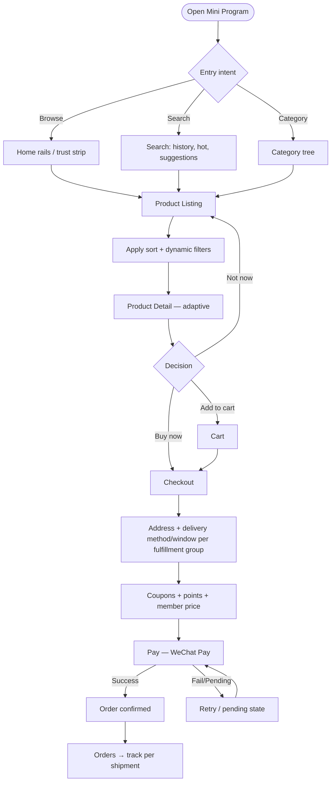
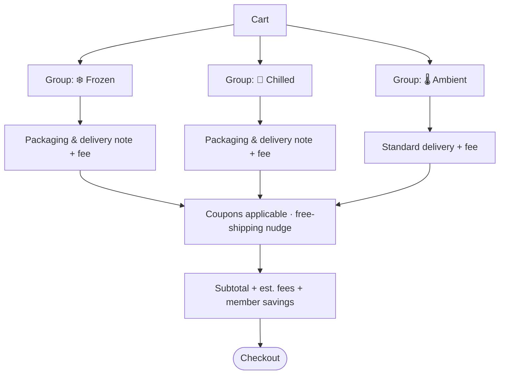
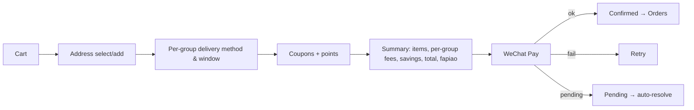
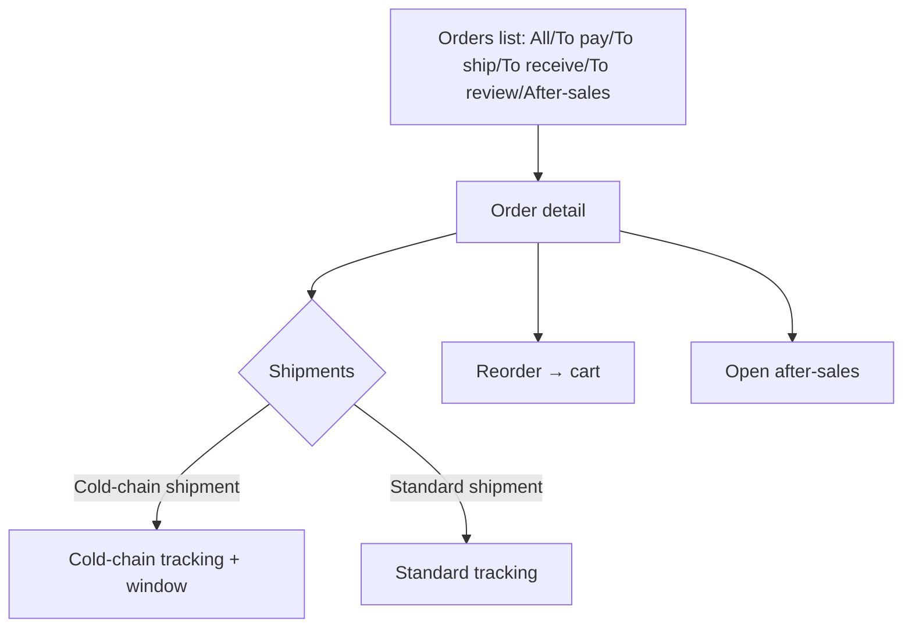
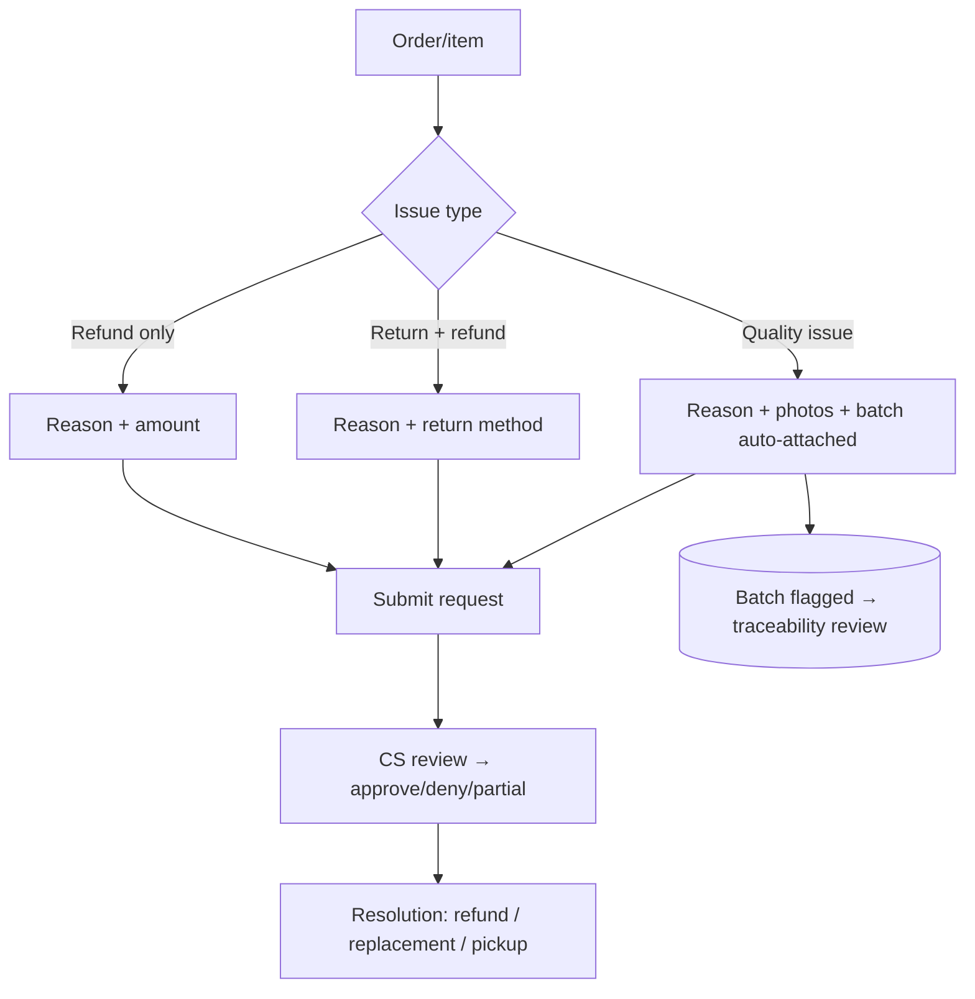
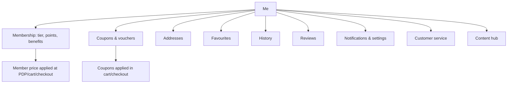
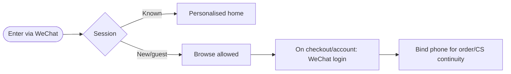

# 08 — Consumer User Flows

Core consumer journeys. Each is category‑agnostic and temperature‑aware where it matters.

## 1. Discovery → Purchase (the spine)



**Imported‑food specifics baked into the spine:**
- **Trust strip & badges** appear during discovery and on the PDP (origin, certification, cold‑chain, wild/farmed).
- **Storage tag** (Frozen/Chilled/Ambient) is visible from the card onward.
- **Cart groups items by fulfillment group** so mixed‑temperature orders are legible before payment.
- **Delivery method, window, and fee are computed per fulfillment group** (a frozen group and an ambient group may ship differently). See [10](10-order-fulfillment-architecture.md).

## 2. Adaptive Product Detail

```mermaid
flowchart TD
    P[PDP loads product + category] --> Q[Render universal blocks]
    Q --> Q1[Gallery, price/member price, promo]
    Q --> Q2[Trust badges]
    Q --> Q3[Key facts: origin, weight, package, storage, shelf life, availability]
    Q --> Q4[Delivery estimate for this item's temperature]
    P --> R{Category attribute set}
    R -->|Seafood| R1[Provenance: species, fishing area, wild/farmed, catch]
    R -->|Meat| R2[Cut & Grade: cut, grade, marbling, farm, processing]
    R -->|Canned| R3[Can & Packing: can size, net/drain weight, medium, ingredients]
    R -->|Future cat| R4[Its configured sections]
    Q4 --> S[Ingredients · Allergens · Nutrition · Prep]
    R1 & R2 & R3 & R4 --> S
    S --> T[Traceability summary — batch/origin  (D-05)]
    T --> U[Reviews + Recommendations]
    U --> V[Sticky: qty · Add · Buy now]
```

The PDP renders **universal blocks always** and **category‑specific sections from the attribute set** — one page, any category.

## 3. Cart with mixed temperatures



## 4. Checkout → Payment → Confirmation



## 5. Orders, tracking, reorder



A single order may have **multiple shipments** with **independent tracking** (cold‑chain vs. standard). The UI shows each shipment's status rather than one blended status.

## 6. After‑sales / quality issue



**Quality issues auto‑attach the batch**, feeding the Manager CS/Warehouse quality signals and enabling a traceability review ([11](11-batch-traceability-architecture.md)).

## 7. Account, membership, coupons



## 8. Entry & identity



> **[ASSUMPTION · A‑02/D‑06]** WeChat login is primary, with phone binding for continuity; guests may browse, login is required to purchase.

## Flow design principles
1. **Temperature is legible before payment** (cards → cart groups → per‑group checkout).
2. **The PDP adapts** to the category via attribute sets — never a category‑specific screen.
3. **Multiple shipments per order are normal**, each tracked independently.
4. **Quality issues connect to batches** for traceability and quality management.
5. **Membership, coupons, and points** thread through PDP, cart, checkout, and account.
