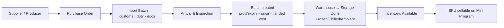
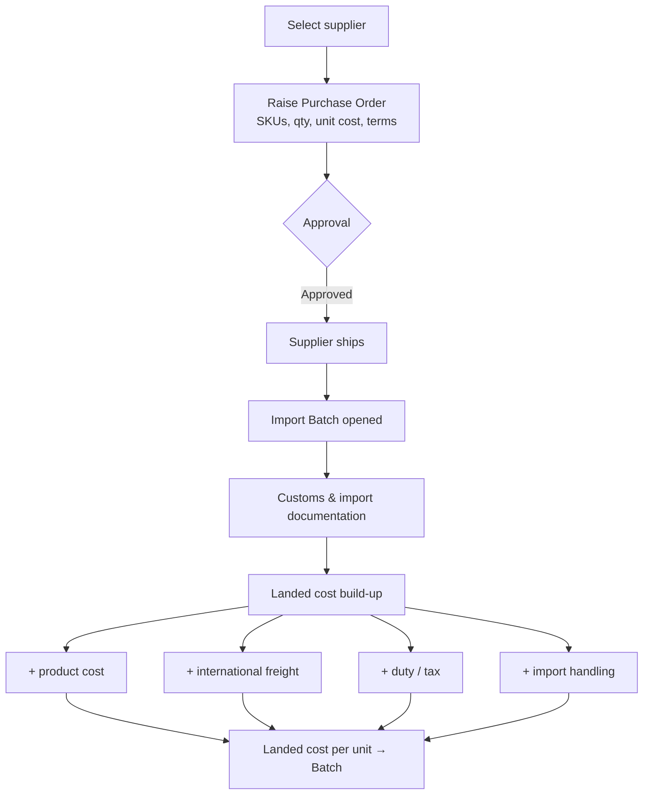
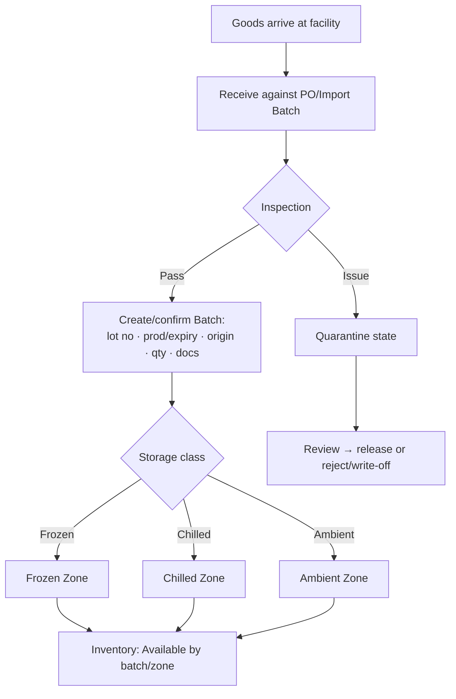
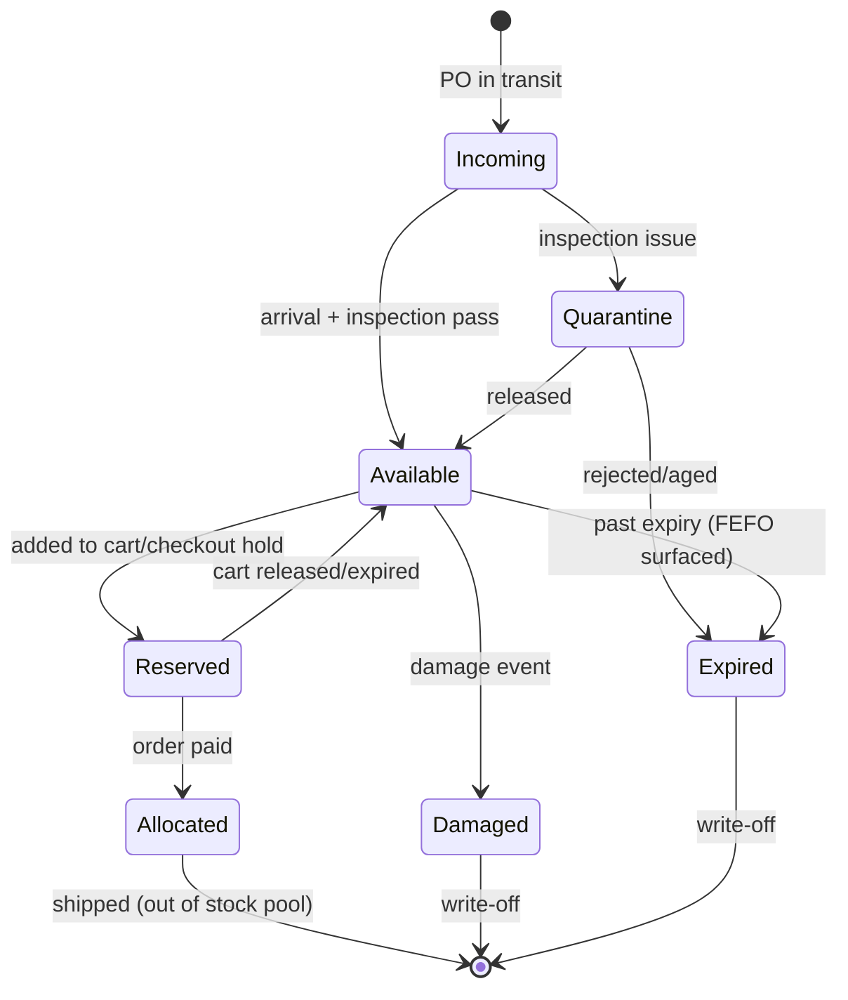
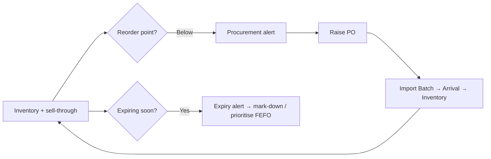
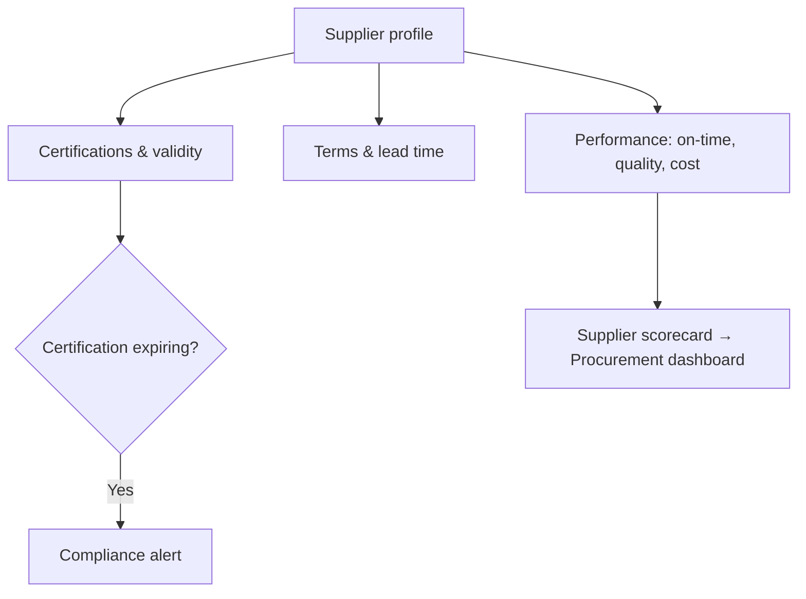

# 09 — Supply Chain Flows

The inbound side of the business: how goods move from an international supplier to a shelf a consumer can buy from — with cost, batch, compliance, and temperature captured along the way.

## 1. The inbound spine

Every step writes to the [core data model](13-core-data-model.md); every step is operated from [Admin → Procurement / Inventory](06-admin-sitemap.md).

## 2. Procurement → Import → Landed cost

**Landed cost is captured per batch.** Because FX, freight, and duty vary shipment to shipment, two batches of the *same* SKU can have different landed costs — so margin is computed **per batch** (and rolls up to per‑order and per‑category in [Finance](06-admin-sitemap.md)).

## 3. Arrival, inspection, and batch creation

- **Quarantine** and **damaged** are explicit stock states, not deletions — they preserve the audit and traceability trail.
- **Storage class routes the goods** to the correct zone automatically (it's a SKU/batch property).

## 4. Stock states and movements

Inventory tracks: **Available · Reserved · Incoming · Allocated · Damaged · Expired · Quarantine.** ([13](13-core-data-model.md))

## 5. Replenishment loop

Reorder points and expiry thresholds drive **Procurement** and **Warehouse** alerts on the [Manager dashboards](07-manager-sitemap.md).

## 6. Supplier & compliance management

Supplier certifications and their validity are tracked; expiry raises a compliance alert (important for *imported* food).

## 7. How this connects forward

- The **batch** created here is the same object the [PDP traceability summary](08-consumer-user-flows.md) and the [after‑sales quality review](11-batch-traceability-architecture.md) read from.
- The **storage class** set here is what the [order/fulfillment engine](10-order-fulfillment-architecture.md) uses to split, pack, and price shipments.
- The **landed cost** captured here is what [Finance/Manager](07-manager-sitemap.md) uses for margin.

## Design principles
1. **Batch is the unit of truth** for provenance, dates, cost, and compliance.
2. **Landed cost is per batch**, enabling honest per‑order/category margin.
3. **Stock states are explicit** (quarantine/damaged/expired preserved for audit).
4. **Storage class routes storage and forward logistics** automatically.
5. **Alerts close the loop** (reorder, expiry, compliance) into Procurement/Warehouse.
