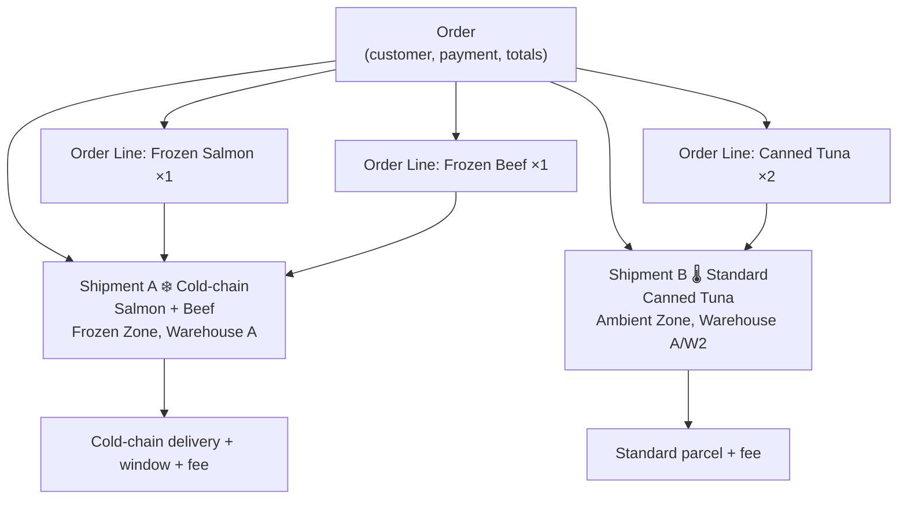
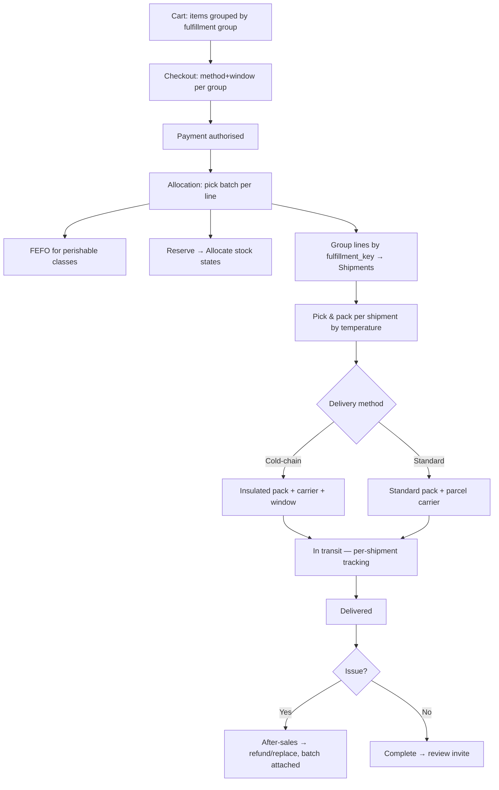
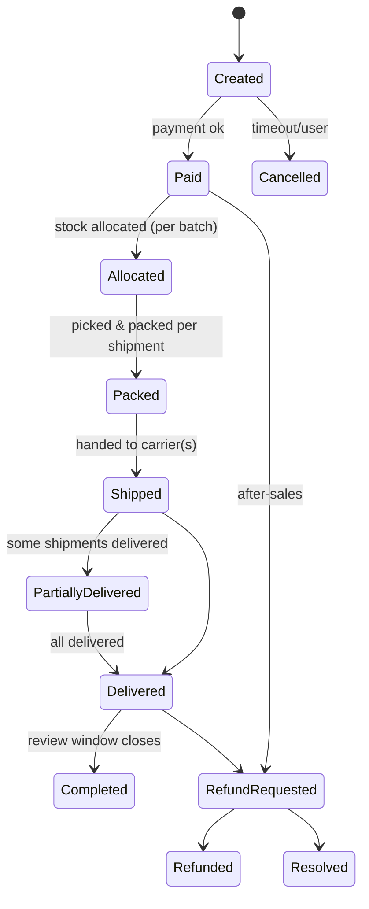

# 10 — Order & Fulfillment Architecture

> Design premise: **a single order routinely contains products of different temperatures, from potentially different warehouses.** The architecture treats that as normal, not exceptional. Never assume one order = one product type.

## 1. The order model, at a glance

An **Order** is the customer's purchase and payment. It fans out into one or more **Shipments**, each of which is a set of order lines that can be **fulfilled and delivered together**.



**One payment, one order, potentially many shipments** — each with its own packaging, carrier, delivery method, window, fee, and tracking.

## 2. The worked example from the brief

A customer buys **Frozen salmon + Frozen beef + Canned tuna.** The engine decides:

| Question | Decision logic | This example |
|----------|----------------|--------------|
| Ship together? | Same **fulfillment group** (storage class × warehouse × delivery method) → together | Salmon + Beef (both Frozen, same WH) → **together**; Tuna (Ambient) → **separate** |
| Separate fulfillment? | Different storage class or warehouse → separate shipment | Yes — 2 shipments |
| Different packaging? | Frozen → insulated/gel; Ambient → standard | Shipment A insulated; Shipment B standard |
| Different delivery fee? | Fee rule per storage class × region × weight | Cold‑chain fee + standard fee (possibly one waived by threshold) |
| Different warehouse? | Allocation may source ambient from a different facility | Possible |

## 3. Fulfillment grouping — the core rule

Order lines are grouped into **shipments** by a **fulfillment key**:

```
fulfillment_key = (storage_class, warehouse, delivery_method[, delivery_window])
```

- **storage_class** — Frozen / Chilled / Ambient (from SKU/batch). Different classes rarely share packaging or carriers → usually separate shipments.
- **warehouse** — allocation may draw an item from a different facility.
- **delivery_method** — cold‑chain express, standard parcel, or local instant (per [D‑02](decisions/decision-log.md)).
- **delivery_window** — cold‑chain deliveries are often window‑bound.

Lines sharing a key ship together; distinct keys become separate shipments. **This rule is category‑agnostic** — a future frozen‑vegetable line groups with the frozen seafood line automatically, because grouping is by storage class, not category.

## 4. From cart to delivered



## 5. Allocation & inventory interaction

- **Reserve at checkout, allocate at payment.** Cart adds create a soft **Reserved** hold; successful payment converts to **Allocated** against a specific **batch**. ([09 state machine](09-supply-chain-flows.md))
- **FEFO for perishables.** Frozen/Chilled classes allocate **first‑expiry‑first‑out**; ambient can use FIFO/FEFO by policy.
- **Batch is recorded on the order line** — this is what makes **order ↔ batch ↔ supplier** traceability possible ([11](11-batch-traceability-architecture.md)).
- **Multi‑warehouse aware** even at single‑warehouse launch ([D‑03](decisions/decision-log.md)): allocation and grouping already key on warehouse.

## 6. Shipping fees & rules

Fees are computed **per shipment**, from a configurable rule set:

```
fee(shipment) = f(storage_class, region, weight/volume, order_value, membership, promotions)
```

- Cold‑chain shipments carry cold‑chain economics (higher, region/window constrained).
- Ambient shipments use standard parcel economics (broad reach).
- **Free‑shipping thresholds, member perks, and coupons** apply per rule (e.g., ambient group crosses free‑shipping threshold while the frozen group still carries a cold‑chain fee).
- The **cart shows per‑group fee implications before checkout** so mixed‑temperature economics are never a surprise.

> **[ASSUMPTION]** Fee rules are configuration (region × storage class × weight × value), editable in [Admin → Logistics](06-admin-sitemap.md). Launch fee tables are set during Step 2/onboarding, not hard‑coded.

## 7. Packaging model

| Storage class | Packaging | Assurance |
|---------------|-----------|-----------|
| Frozen | Insulated box + gel/dry ice, sealed | Temperature integrity, tamper‑evident |
| Chilled | Insulated + gel, short window | Cold‑chain window discipline |
| Ambient | Standard parcel | Standard |

Packaging is derived from storage class at pack time — again, no category logic.

## 8. Order states



Because an order can have multiple shipments, the order surfaces **per‑shipment status** and a rolled‑up state (e.g., *Partially delivered*).

## 9. Edge cases the model already anticipates

- **Partial stockout at allocation** → split further, backorder, or substitute (policy‑driven); customer notified per shipment.
- **Mixed member/promo pricing** → member price and promotions resolve per line; totals itemise savings.
- **Return of one item from a multi‑shipment order** → after‑sales operates at **line/shipment granularity**, with the **batch attached** for quality tracing.
- **Different delivery addresses (gifting)** — out of launch scope but not precluded: address is on the shipment, not only the order.

## Design principles
1. **Order → Shipment(s)**; one payment can yield many shipments.
2. **Group by storage class × warehouse × delivery method** — category‑agnostic.
3. **Allocate against a specific batch** (FEFO for perishables) → enables traceability & margin.
4. **Fees, packaging, windows are per shipment**, from configurable rules.
5. **Per‑shipment tracking and after‑sales**; the order shows a rolled‑up state.
