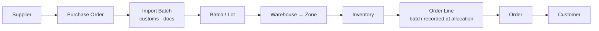
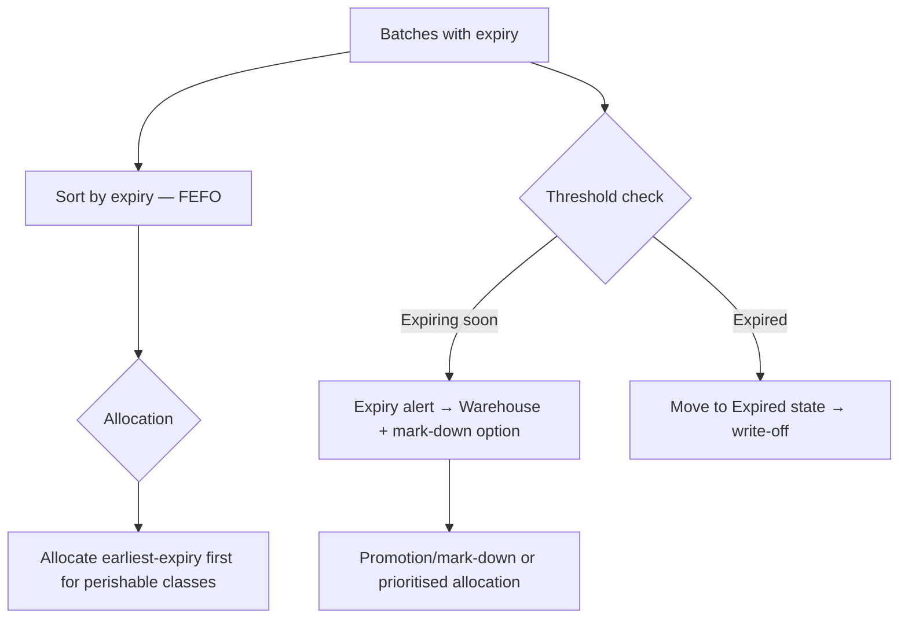
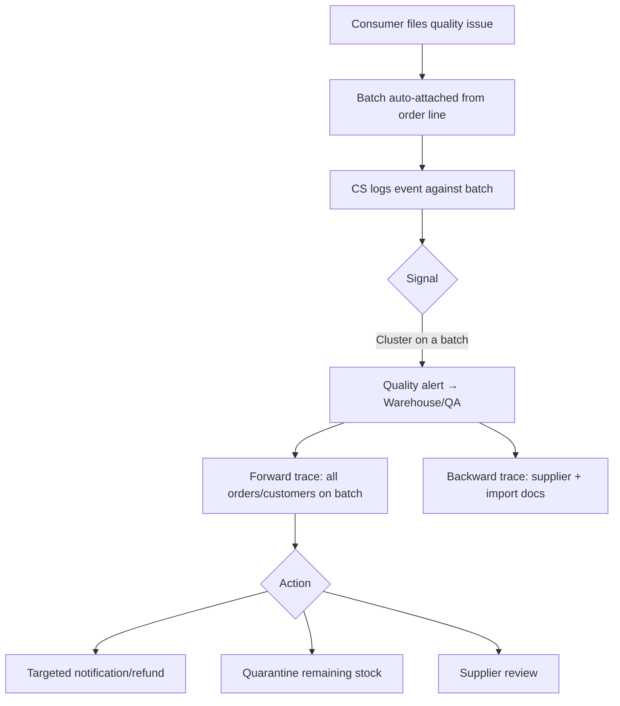

# 11 — Batch & Traceability Architecture

> Because this is an **imported‑food** platform, batch management is a core capability, not an add‑on. It underpins freshness, safety, recalls, margin, and the consumer trust promise.

## 1. Why batch is central

- **Provenance** — imported goods must credibly state origin, producer, certification.
- **Freshness/safety** — production/expiry dates and cold‑chain condition are batch‑level facts.
- **Cost/margin** — landed cost varies per consignment (FX, freight, duty).
- **Recall/quality** — a problem is almost always batch‑scoped; we must find every affected order and customer.
- **Consumer trust** — the four brand pillars ([01](01-product-vision.md)) are only credible if backed by real batch data.

## 2. What a batch records

| Group | Fields |
|-------|--------|
| Identity | Batch/lot number, parent SKU, import batch reference |
| Dates | Production date, expiry/best‑before, arrival date |
| Origin | Country of origin, producer/manufacturer, (catch/farm/field lot) |
| Supply | Supplier, importer, purchase order |
| Storage | Warehouse, zone, storage class, storage condition |
| Quantity | Received, current available/reserved/allocated/damaged/expired/quarantine |
| Cost | Landed cost per unit (product + freight + duty + handling) |
| Compliance | Customs info, import documentation, certifications, test/inspection records |

## 3. The traceability chain (both directions)

- **Forward (recall):** *Batch → every Order Line → Order → Customer* — "who received units from batch AU‑2026‑0417?"
- **Backward (provenance):** *Order Line → Batch → Import Batch → Supplier* — "where did this item come from, and with what documents?"

The link that makes both possible: **the allocated batch is stamped on the order line** at payment/allocation ([10](10-order-fulfillment-architecture.md)).

## 4. Expiry management (FEFO)

- **First‑Expiry‑First‑Out** allocation for Frozen/Chilled; policy‑selectable for Ambient.
- **Expiring‑inventory alerts** feed the [Warehouse](07-manager-sitemap.md) and [Admin inventory](06-admin-sitemap.md) surfaces.
- **Expired/damaged** are explicit states → controlled write‑off, preserving audit.

## 5. Quality event → traceability review

This is where consumer after‑sales ([08](08-consumer-user-flows.md)) connects to supply‑chain integrity: a spike of issues on one batch triggers a **forward trace** (contain customer impact) and a **backward trace** (root cause at supplier/import).

## 6. Consumer‑facing traceability (phased — [D‑05](decisions/decision-log.md))

| Level | What the shopper sees | Data source |
|-------|-----------------------|-------------|
| 1 (launch min) | Trust badges: origin, certification, cold‑chain | Product/Batch |
| 2 (**recommended launch**) | "This batch": origin, production/expiry, import batch summary | Batch |
| 3 (differentiator) | Full scan‑to‑trace journey (supplier → import → warehouse → you) | Chain |

All levels read from the **same batch/chain data**; the difference is only how much is surfaced.

## 7. Compliance documentation

Import documentation, customs information, certifications, and inspection/test records attach to **Import Batch** and **Batch**. They are:
- **Structured & referenced** (not loose files with no linkage),
- **Permissioned** (visible to procurement/warehouse/QA/CS per [RBAC](12-roles-permissions.md)),
- **Auditable** (who uploaded/verified, when).

## 8. Where traceability shows up across surfaces

| Surface | Traceability touchpoint |
|---------|-------------------------|
| Consumer | Trust badges; "this batch" summary; (future) scan‑to‑trace |
| Admin | Batch records; stock movements; document management; forward/backward trace tools |
| Manager | Quality signals by batch (CS/Warehouse dashboards); expiry & write‑off KPIs |

## Design principles
1. **Batch is the unit of truth** for provenance, dates, cost, compliance, and quality.
2. **Allocation stamps the batch on the order line** — enabling two‑way trace.
3. **FEFO + explicit stock states** manage freshness and preserve audit.
4. **Quality events attach the batch automatically**, linking consumer issues to supply‑chain root cause.
5. **Consumer surfacing is a phased UI choice over complete underlying data.**
