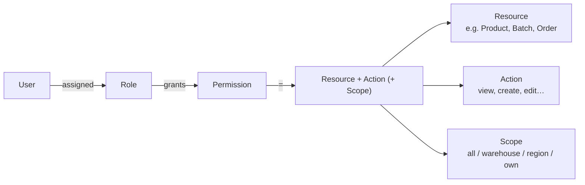

# 12 — Roles & Permissions (RBAC)

A single, scalable RBAC model spans Admin and Manager. It is resource‑ and action‑oriented so new modules (and future categories) inherit permissions without redesign.

> **[ASSUMPTION · A‑10]** One shared RBAC system and one audit trail across Admin and Manager.

## 1. The model

`User → Role → Permission → Resource → Action`, with an optional **Scope** (e.g., a warehouse manager acts only on *their* warehouse). A user may hold multiple roles; permissions are the union.

## 2. Actions

`view · create · edit · delete · approve · publish · export · refund · adjust_inventory · manage_pricing · manage_suppliers · manage_orders`

(Plus generic `assign` for RBAC administration.)

## 3. Resources (grouped)

Catalog: Category, Attribute Set, Product, SKU, Brand, Pricing, Content
Supply: Supplier, Purchase Order, Import Batch, Cost
Inventory: Warehouse, Storage Zone, Batch, Stock, Stock Movement, Expiry
Orders: Order, Fulfillment, Payment, Refund/After‑sales, Shipment
Logistics: Shipping Rule, Region, Tracking, Exception
Customers: Customer, Membership, Points, Coupon, CS Ticket
Marketing: Campaign, Promotion, Homepage, Recommendation
Finance: Revenue, Landed Cost, Margin, Payout
Platform: Staff User, Role, Permission, Audit Log, Configuration
Manager: each role Dashboard

## 4. Roles (launch set)

| Role | Purpose | Home surface |
|------|---------|--------------|
| **Super Admin** | Platform owner; full control incl. RBAC & config | Admin |
| **General Manager** | Executive oversight; approvals; all dashboards (read) | Manager |
| **Operations Manager** | Orders, fulfillment, logistics oversight | Manager + Admin (orders/logistics) |
| **Merchandiser / Catalog** | Categories, products, attributes, pricing, content | Admin |
| **Procurement Manager** | Suppliers, POs, import batches, costs | Admin + Manager (procurement) |
| **Warehouse Manager** | Inventory, batches, zones, expiry (scoped to warehouse) | Admin + Manager (warehouse) |
| **Logistics Manager** | Shipments, regions, rules, exceptions | Admin + Manager (logistics) |
| **Marketing Manager** | Campaigns, coupons, homepage, recommendations | Admin + Manager (marketing) |
| **Customer Service** | Orders (view), after‑sales, refunds (limited), tickets | Admin |
| **Finance** | Revenue, cost, margin, refunds approval, exports | Admin + Manager (finance) |
| **Content Editor** | Recipes, education, brand/origin stories | Admin |

Roles are **data**; new roles (e.g., "QA Manager", "Category Lead — Dairy") are created without code changes.

## 5. Permission matrix (representative)

`✓` = allowed · `A` = approve‑level · `S` = scoped (e.g., own warehouse/region) · `R` = read‑only · blank = none.

| Resource ↓ / Role → | Super Admin | GM | Ops | Merch | Procure | Warehouse | Logistics | Mktg | CS | Finance | Content |
|---|:--:|:--:|:--:|:--:|:--:|:--:|:--:|:--:|:--:|:--:|:--:|
| Category / Attribute Set | ✓ | R | R | ✓ | R | R |  | R |  |  |  |
| Product / SKU | ✓ | R | R | ✓ | R | R |  | R | R |  |  |
| Pricing | ✓ | A | R | ✓ (manage_pricing) | R |  |  | R |  | R |  |
| Brand | ✓ | R |  | ✓ | R |  |  | R |  |  |  |
| Content | ✓ | R |  | R |  |  |  | ✓ |  |  | ✓ (publish) |
| Supplier | ✓ | R |  |  | ✓ (manage_suppliers) | R |  |  |  | R |  |
| Purchase Order | ✓ | A |  |  | ✓ (create/edit; approve≤limit) | R |  |  |  | A |  |
| Import Batch / Cost | ✓ | R |  |  | ✓ | R |  |  |  | R |  |
| Warehouse / Zone | ✓ | R | R |  |  | ✓S |  |  |  |  |  |
| Batch | ✓ | R | R | R | R | ✓S |  |  | R | R |  |
| Stock / Movement (adjust_inventory) | ✓ | R | R |  | R | ✓S |  |  |  | R |  |
| Expiry | ✓ | R | R |  | R | ✓S |  |  |  | R |  |
| Order (manage_orders) | ✓ | R | ✓ | R | R | R(fulfil)S | R | R | ✓ (view/service) | R |  |
| Fulfillment | ✓ | R | ✓ |  |  | ✓S | ✓ |  | R |  |  |
| Payment | ✓ | R | R |  |  |  |  |  | R | ✓ |  |
| Refund / After‑sales (refund) | ✓ | A | ✓≤limit |  |  |  |  |  | ✓≤limit | A |  |
| Shipment / Tracking | ✓ | R | ✓ |  |  | R S | ✓S |  | R |  |  |
| Shipping Rule / Region | ✓ | A | R |  |  |  | ✓ |  |  | R |  |
| Exception | ✓ | R | ✓ |  |  | R | ✓S |  | R |  |  |
| Customer | ✓ | R | R |  |  |  |  | R | ✓ | R |  |
| Membership / Points | ✓ | R |  |  |  |  |  | ✓ | ✓≤limit | R |  |
| Coupon / Promotion | ✓ | A |  |  |  |  |  | ✓ | R | R |  |
| Campaign / Homepage / Rec | ✓ | A |  | R |  |  |  | ✓ (publish) |  |  | R |
| CS Ticket | ✓ | R | ✓ |  |  |  |  |  | ✓ |  |  |
| Revenue / Margin | ✓ | R | R |  | R S |  |  | R |  | ✓ (export) |  |
| Landed Cost | ✓ | R |  |  | R |  |  |  |  | ✓ |  |
| Staff User / Role / Permission (assign) | ✓ | R |  |  |  |  |  |  |  |  |  |
| Audit Log | ✓ | R |  |  |  |  |  |  |  | R |  |
| Configuration | ✓ | R |  |  |  |  |  |  |  |  |  |
| Manager: Executive dashboard | ✓ | ✓ |  |  |  |  |  |  |  |  |  |
| Manager: Ops / Proc / WH / Log / Mktg / CS / Fin dashboards | ✓ | ✓ (all) | Ops | | Proc | WH‑S | Log | Mktg | CS | Fin |  |

*The matrix is representative, not exhaustive; it shows the pattern and the approval/scope levers. Exact limits (e.g., refund and PO approval thresholds) are configuration.*

## 6. Approvals, scopes, and limits

- **Approval levels:** POs above a value, refunds above a threshold, price changes, campaign go‑live, and homepage publishes require an `approve`‑capable role. Thresholds are configuration.
- **Scopes:** Warehouse Manager → own warehouse/zones; Logistics Manager → own regions; CS → refunds ≤ limit. Scope prevents over‑exposure ("do not expose unnecessary information to each role").
- **Separation of duties:** the creator of a PO/refund is not its approver (configurable).

## 7. Audit

Every privileged action (`create/edit/delete/approve/publish/refund/adjust_inventory/manage_pricing/assign/export`) writes an **Audit Log**: actor, role, resource, action, before/after, timestamp, scope. Audit is read‑only to GM/Finance, full to Super Admin.

## 8. Manager least‑information principle

Manager dashboards are **filtered by role**: each functional manager sees their KPIs, alerts, tasks, and actions — not the whole business. The GM sees all dashboards read‑only plus executive approvals. This is enforced by the same permission model (the "Manager: … dashboard" resources above).

## Design principles
1. **User → Role → Permission → Resource → Action (+ Scope).**
2. **Roles and resources are data** — new modules/categories inherit the pattern.
3. **Approvals + scopes + limits** are configuration, enabling separation of duties and least‑privilege.
4. **One audit trail** across Admin and Manager.
