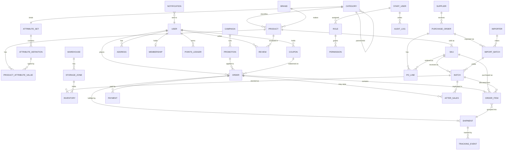

# 13 — Core Data Model (Conceptual)

A **conceptual** model — entities and relationships, not columns or database technology (that is Step 2). It expresses the architecture: one universal product model, batch‑centric inventory, and two‑way traceability.

## 1. Entity‑relationship overview



*(Mermaid renders on GitHub. A plain‑text summary follows for readers of raw markdown.)*

## 2. Entity catalog

### Catalog & merchandising
- **Category** — node in the taxonomy tree; parent/child; binds one Attribute Set; holds category filters & compliance flags.
- **Attribute Set** — ordered collection of Attribute Definitions bound to a category (inheritable).
- **Attribute Definition** — key, label(s), data type, unit, allowed values, filterable?, searchable?, required?, PDP section, order, level(product/SKU).
- **Product** — the marketed item; belongs to a Category and Brand; carries universal food/import fields and Product Attribute Values.
- **Product Attribute Value** — a Product's value for one Attribute Definition (the configurable layer).
- **Brand** — manufacturer/marque.
- **SKU** — buyable variant of a Product: pack, barcode, base/member/promo price, **storage class**, logistics constraints, status.
- **Pricing** — base, member, promotional (time‑boxed); tax class. (Modelled on SKU + Promotion.)
- **Content** — recipes, education, brand/origin stories; linked to products/categories.

### Supply chain
- **Supplier** — producer/vendor; certifications, terms, performance.
- **Importer** — party clearing customs.
- **Purchase Order** + **PO Line** — procurement of SKUs from a Supplier.
- **Import Batch** — a customs/import event; documents, duty, landed‑cost components; yields Batches.

### Inventory
- **Warehouse** — a facility.
- **Storage Zone** — Frozen/Chilled/Ambient area within a warehouse.
- **Batch (Lot)** — a received consignment of a SKU: lot no, production/expiry, origin, supplier, import batch, landed cost, compliance docs.
- **Inventory** — quantity of a Batch in a Zone, by stock state (Available/Reserved/Incoming/Allocated/Damaged/Expired/Quarantine).
- **Stock Movement** — receipt/transfer/adjustment/allocation/write‑off (audit of quantity changes).

### Customers & commerce
- **User** — consumer identity + profile.
- **Address** — delivery addresses.
- **Membership** — tier & benefits; **Points Ledger** — loyalty balance/history.
- **Coupon** — issued voucher; **Promotion** — rule (discount/bundle/threshold); **Campaign** — grouping of promotions/content.
- **Order** + **Order Item** — the purchase; each item records the **allocated Batch**.
- **Shipment** — a fulfillment/delivery group of Order Items (by fulfillment key); has **Tracking Event**s.
- **Payment** — payment record(s) for an Order.
- **Review** — verified‑purchase product review.
- **After‑sales** — refund/return/quality request at item/shipment granularity; references the **Batch**.
- **Notification** — messages to a User (or staff).

### Platform
- **Staff User** — Admin/Manager user.
- **Role**, **Permission** — RBAC ([12](12-roles-permissions.md)).
- **Audit Log** — record of privileged actions.
- **Configuration** — storage classes, regions, fee rules, attribute sets, feature flags.

## 3. The two relationship spines the brief calls out

**A. Product ↔ SKU ↔ Batch ↔ Inventory**
```
PRODUCT ─1:N─ SKU ─1:N─ BATCH ─1:N─ INVENTORY ─N:1─ STORAGE_ZONE ─N:1─ WAREHOUSE
```
One product, many buyable SKUs; each SKU received as many batches; each batch stocked as inventory in a specific zone/warehouse and stock state. **Price lives on SKU; provenance/expiry/landed‑cost live on Batch; quantity/state live on Inventory.** This separation is what lets the same product carry multiple consignments with different costs and expiries.

**B. Supplier → Procurement → Import → Batch → Warehouse → Inventory → Order → Customer**
```
SUPPLIER ─▶ PURCHASE_ORDER ─▶ IMPORT_BATCH ─▶ BATCH ─▶ (WAREHOUSE/ZONE) ─▶ INVENTORY
        ─▶ ORDER_ITEM (batch stamped at allocation) ─▶ ORDER ─▶ USER(customer)
```
This is the **traceability chain** ([11](11-batch-traceability-architecture.md)): the `BATCH ↔ ORDER_ITEM` link (stamped at allocation) closes the loop, enabling forward (recall) and backward (provenance) tracing.

## 4. Why this model is category‑agnostic

- **No per‑category entities.** "Seafood" and "Meat" are Category rows; their differences are Attribute Definitions in their Attribute Sets and Product Attribute Values on their products.
- **Temperature is a SKU/Batch attribute** (storage class), so inventory, orders, and logistics reason about it uniformly.
- **Adding a category** = new Category + Attribute Set (+ optionally new Attribute Definitions) — **data**, not schema change. See [20 — Future Scalability](20-future-scalability.md).

## 5. Cardinality notes (selected)
- Category self‑referential (tree); one Attribute Set per Category (with inheritance).
- Product 1‑N SKU; SKU 1‑N Batch; Batch 1‑N Inventory (by zone/state).
- Order 1‑N Order Item; Order 1‑N Shipment; Order Item N‑1 Shipment.
- Order Item N‑1 Batch (allocated); Batch 1‑N Order Item (traceability).
- User 1‑N Order; Staff User N‑N Role; Role 1‑N Permission.

## 6. Out of scope for Step 1 (goes to Step 2)
Physical schema, keys/indexes, data types, storage engine, API contracts, event model, and non‑functional design.
