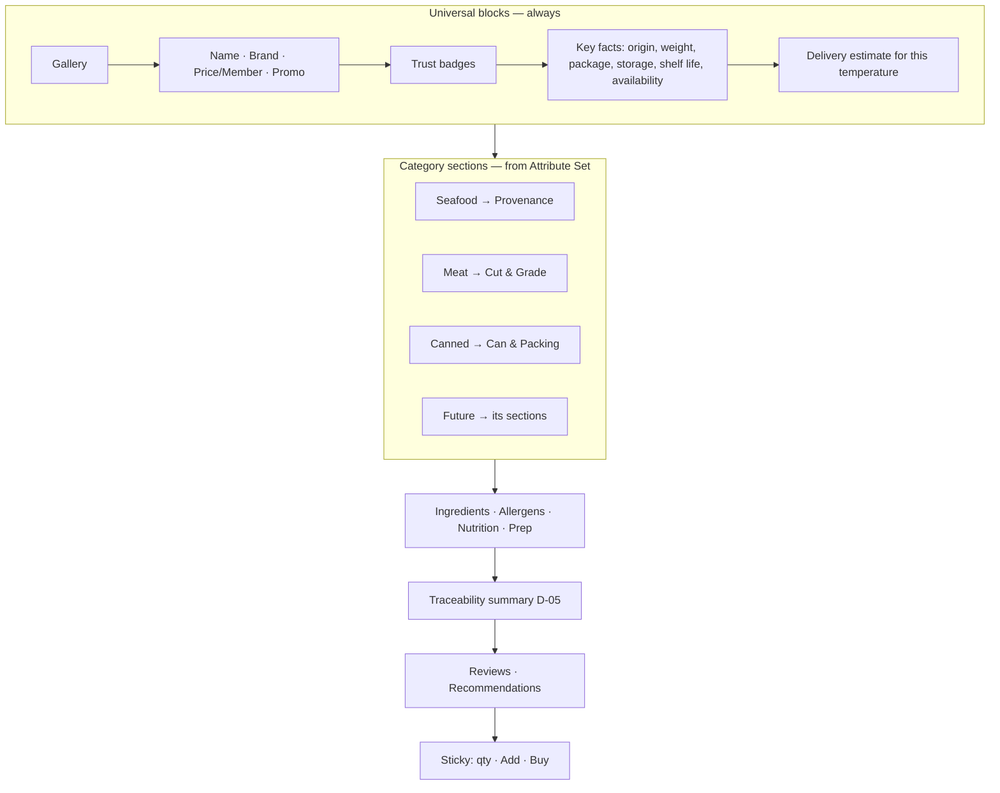
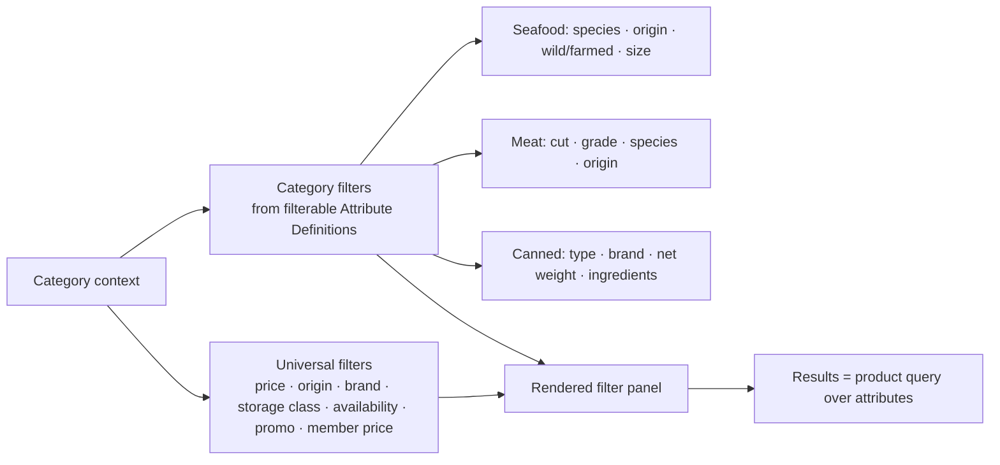

# 14 — UX Architecture

How the interface behaves — navigation models, core patterns, and the two mechanisms that make one UI serve every food category: the **adaptive PDP** and the **dynamic filter framework**.

## 1. Navigation models per surface

| Surface | Model | Rationale |
|---------|-------|-----------|
| Consumer | **5‑tab bottom nav** (Home · Categories · Cart · Orders · Me) + search + deep flows | WeChat Mini Program convention; thumb‑reachable; shallow depth |
| Admin | **Left module rail** + breadcrumb + list/detail/editor | Dense, multi‑module operations tool |
| Manager | **Role‑scoped dashboard shell** + drill‑downs | Executive, least‑information, action‑oriented |

## 2. Consumer interaction principles (Pupu‑inspired, our identity)

1. **Fast first paint, scannable rails.** Home is vertical rails of product cards; a shopper flicks through Best Sellers / Imported Selection / New / Deals.
2. **Two ways to find:** browse (Categories tab, shallow tree) and search (with history, hot terms, suggestions).
3. **Cards do the selling:** image, name, origin flag, **storage tag**, price + member price, a badge or two, one‑tap add.
4. **Trust is ambient:** a trust strip on Home; trust badges on cards and PDP.
5. **Cart is honest:** items grouped by temperature/fulfillment group; per‑group delivery implications shown before checkout.
6. **Minimal taps to buy:** PDP sticky add/buy; guest browse, login at purchase.

## 3. The adaptive Product Detail Page (PDP)

The PDP is **one screen** that composes **universal blocks (always)** + **category‑specific sections (from the attribute set)**.

**How it adapts:** each Attribute Definition declares a `pdp_section`. The PDP groups the product's attribute values by section and renders sections in a fixed order. A seafood product shows *Provenance*; a canned product shows *Can & Packing*; a future dairy product shows whatever its set defines — **no PDP code changes per category.**

## 4. The dynamic filter framework {#filters}

Filters are **generated from Attribute Definitions**, not hard‑coded.

- **Universal filters** apply everywhere: category, brand, **country of origin**, price, weight, **storage type (frozen/chilled/ambient)**, availability, promotions, **member price**.
- **Category‑specific filters** appear **dynamically** based on which Attribute Definitions are marked `filterable` (and their style: term, range, boolean).
- **Filter style follows data type:** enum → multi‑select chips; measure → range slider (with unit); boolean → toggle.
- **Configurable, not coded:** turning "marbling grade" into a filter for Beef is a checkbox in [Admin → Category → Filter configuration](06-admin-sitemap.md).

## 5. Search architecture (UX view)

- **Entry:** persistent search field on Home/Categories; history + hot searches + type‑ahead suggestions.
- **Scope:** keyword, product, brand, category, **origin**, SKU/barcode. (Detailed in the brief §10.)
- **Results:** the same listing + dynamic filters as a category page, so filtering behaves identically whether you arrived via search or browse.
- **Zero/low results:** suggest corrections, related categories, and popular imported items.

## 6. Reusable consumer patterns

| Pattern | Where used |
|---------|-----------|
| Product card | Home rails, listing, search, recommendations |
| Storage tag (❄️/🧊/🌡️) | Card, cart group, PDP key facts |
| Trust badge row | Home strip, card (compact), PDP |
| Fulfillment group block | Cart, checkout, order detail |
| Price stack (price + member price + promo) | Card, PDP, cart |
| Filter panel | Listing, search |
| Status timeline | Order detail, shipment tracking |

## 7. Admin UX patterns

- **List → Detail → Editor** across modules; consistent table (filters, bulk actions, status chips, row actions).
- **Adaptive Product Editor** — the mirror of the adaptive PDP: it renders the selected category's attribute fields, grouped by section. One editor builds any product.
- **Alert → object → action** — alerts (low stock, expiring, exception) deep‑link to the record and the primary action.
- **Batch‑aware everywhere** — stock, orders, and finance expose batch context where relevant.

## 8. Manager UX patterns

- **Dashboard = KPIs → Alerts → Tasks → Actions.** Every dashboard ends in an action, not just a chart.
- **Role‑scoped shell** — the nav shows only the dashboards a role may see ([12](12-roles-permissions.md)).
- **Drill‑down, not duplicate** — clicking a KPI opens detail (often into Admin), rather than re‑implementing operational screens.

## 9. Accessibility, localisation, performance (principles)

- **Localisation:** Simplified Chinese first; strings & labels externalised; currency ¥; metric + per‑100g nutrition. i18n retained for future markets ([A‑02](decisions/decision-log.md)).
- **Accessibility:** sufficient contrast, tap targets ≥ 44px, legible type scale, non‑colour‑only status (icon + label for temperature/stock).
- **Performance:** Mini Program constraints — lightweight home, lazy images, paginated listings, cached category tree/attribute sets.

## 10. States every screen must handle
Loading · empty · error · offline/slow · partial data (e.g., product missing an optional attribute — the section simply doesn't render) · restricted (permission) · out‑of‑stock / unavailable.

## Design principles
1. **One adaptive PDP and one adaptive Editor** serve all categories via attribute sets.
2. **Filters and search are generated from attributes** — configuration, not code.
3. **Temperature and trust are first‑class UI**, visible from card to checkout.
4. **Consumer shallow, backend deep.**
5. **Manager dashboards end in actions.**
