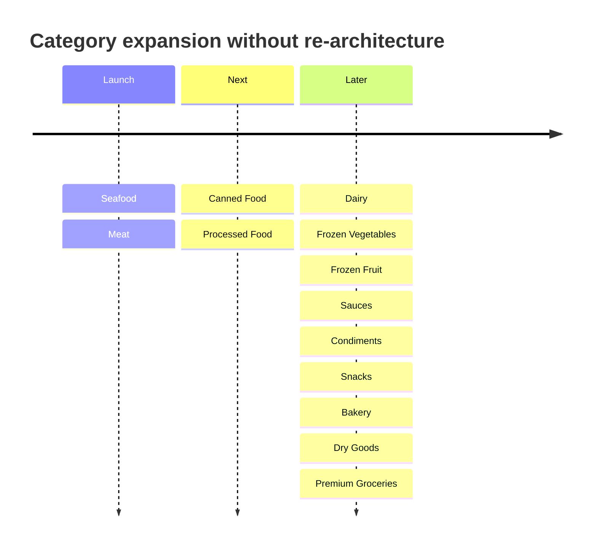
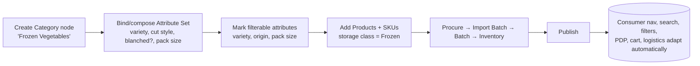

# 20 — Future Scalability

The architecture's single most important test: **can the company add new categories without redesigning the platform?** This document proves the answer is yes, and shows exactly how.

## 1. The growth path

At every step, the **platform structure, data model, and UI are unchanged** — only **data** is added.

## 2. Adding a category is a data operation, not a rebuild

To onboard, say, **Frozen Vegetables**:

**No engineering ticket is required for the platform to understand the new category** — because navigation, search, filters, PDP, and logistics all render from configuration.

## 3. What each capability inherits for free

| Capability | How a new category inherits it | Why no redesign |
|-----------|-------------------------------|-----------------|
| **Navigation** | Appears in the category tree | Tree is data |
| **Attributes** | Compose an Attribute Set | Attribute engine is universal |
| **Filters** | Mark attributes `filterable` | Filters generate from attributes |
| **Search** | Attributes marked `searchable` are indexed | Index reads the universal model |
| **PDP** | Attribute `pdp_section` placement | PDP composes sections dynamically |
| **Admin editor** | Same adaptive editor renders the set | One editor, all categories |
| **Storage/logistics** | Set SKU **storage class** | Inventory/orders/fees key on storage class, not category |
| **Batch/traceability** | Batches created at receiving | Batch model is category‑agnostic |
| **Orders/fulfillment** | Grouping by storage class | Mixed‑temperature already handled |
| **RBAC** | Same resources/actions | Permissions are pattern‑based |
| **Manager KPIs** | Category appears in category mix | Reporting reads categories generically |

## 4. Dimensions of scale the architecture supports

- **Dynamic categories** — unlimited tree depth/breadth as data.
- **Dynamic product attributes** — new Attribute Definitions any time.
- **Category‑specific filters** — per‑category, configured not coded.
- **Multiple storage types** — Frozen/Chilled/Ambient today; new classes (e.g., "Cool") addable.
- **Multiple warehouses** — inventory keyed on warehouse→zone regardless of count ([D‑03](decisions/decision-log.md)).
- **Multiple suppliers & import batches** — procurement/import model is many‑to‑many.
- **Multiple fulfillment methods** — per‑shipment delivery strategy ([D‑02](decisions/decision-log.md)).
- **Multiple shipping requirements** — fee/packaging rules by storage class × region.
- **Membership/pricing models** — base + member + promo pricing simultaneously ([D‑04](decisions/decision-log.md)).
- **Internationalisation** — i18n fields retained for future markets ([A‑02](decisions/decision-log.md)).
- **Compliance gating** — reserved flag for future regulated goods ([D‑07](decisions/decision-log.md)).

## 5. Anti‑patterns explicitly avoided

| Anti‑pattern (would make it "a seafood app") | What we did instead |
|----------------------------------------------|---------------------|
| Separate product tables for seafood/meat/canned | **One universal product model** |
| Hard‑coded seafood filters (species, wild/farmed) | **Filters generated from attributes** |
| Temperature inferred from category | **Storage class on SKU/batch** |
| Category‑specific PDP screens | **One adaptive PDP** |
| Category‑specific admin editors | **One adaptive editor** |
| "Seafood" baked into navigation/search | **Category tree + collections as data** |
| One order = one product type assumption | **Order → multiple shipments by storage class** |
| Seafood‑centric branding tokens | **Brand tokens decoupled; temperature colours are functional** |

## 6. Guardrails to keep it scalable (governance)

To ensure the platform *stays* a platform as teams grow:
1. **No category‑specific code paths** in catalog, search, filters, PDP, or editor — attribute‑driven only.
2. **The "meaningful to >1 category?" test** governs universal‑vs‑category fields ([04 §4](04-product-category-architecture.md)).
3. **Storage class is the only temperature switch** — nothing else infers temperature.
4. **New behaviours are configuration first** (attribute, flag, rule) before code.
5. **Category onboarding is a documented data playbook**, owned by Merchandising, not Engineering.

## 7. The success signal

As the catalog broadens, **seafood's share of GMV falls** — surfaced on the [Executive dashboard](07-manager-sitemap.md). That declining share is the visible proof that we built **an imported‑food platform that started with seafood and meat**, exactly as intended.
